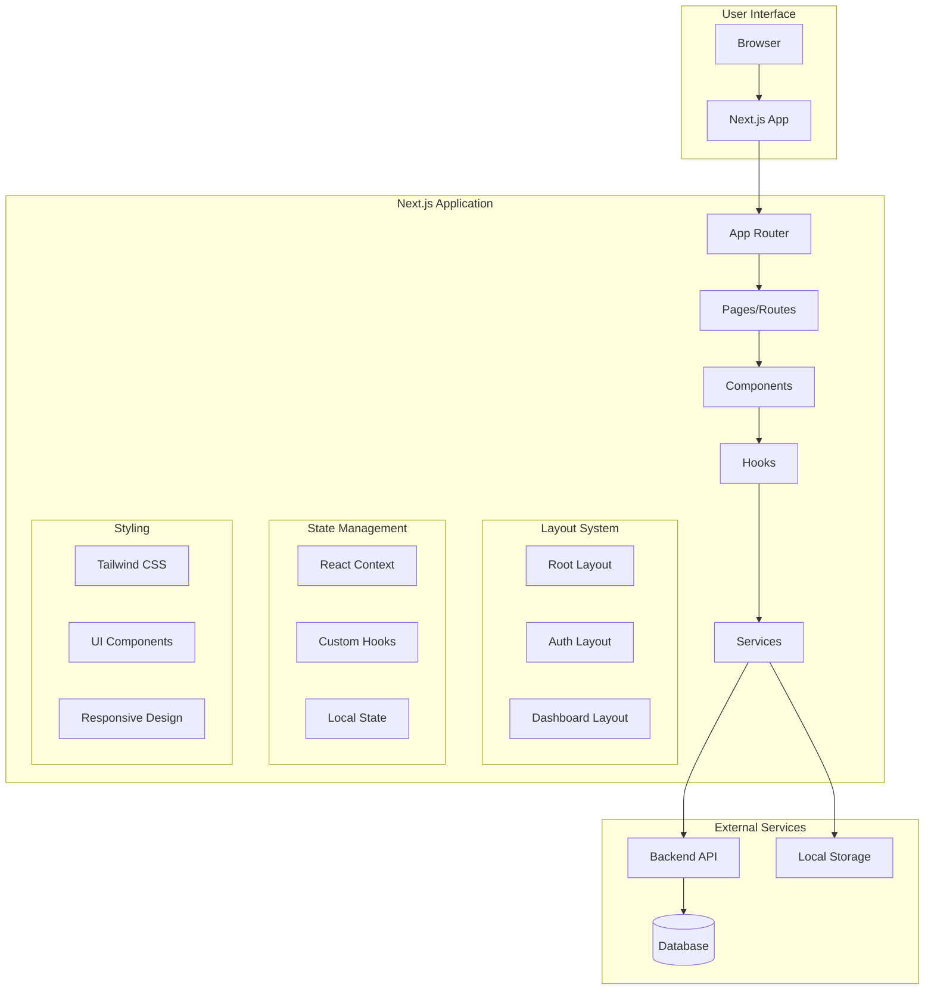
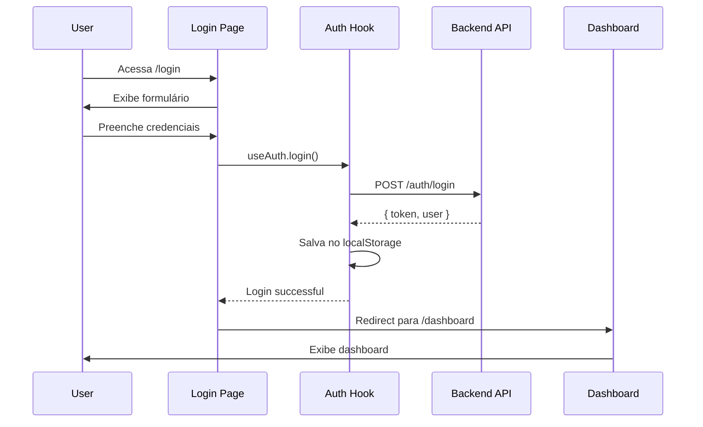
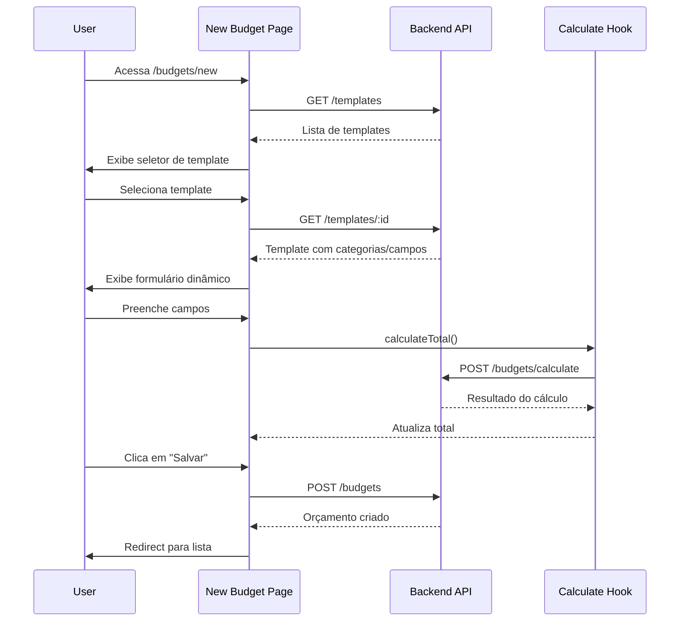
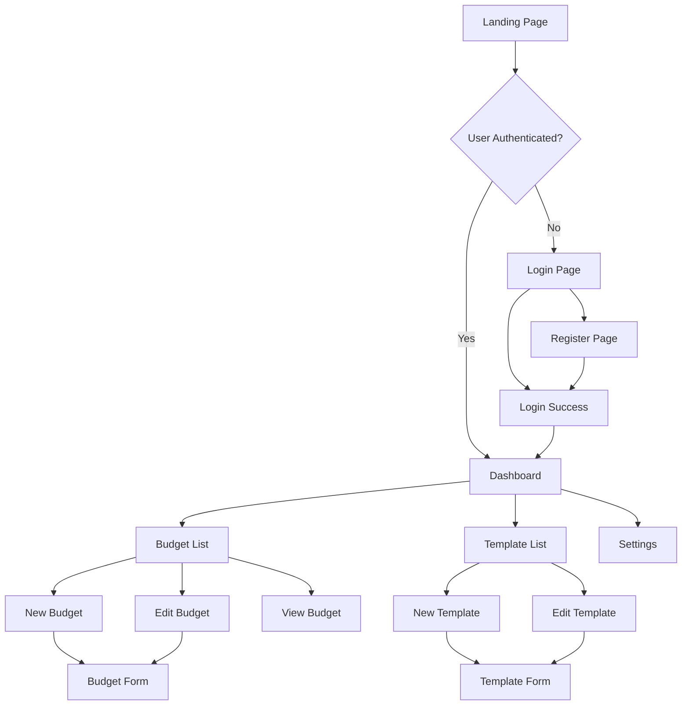

# 🎨 OrcaPro Frontend

Interface web moderna e responsiva para gestão de orçamentos desenvolvida com Next.js 15, React e TypeScript.

## 📋 Índice

- [Visão Geral](#visão-geral)
- [Arquitetura do Frontend](#arquitetura-do-frontend)
- [Fluxo do Usuário](#fluxo-do-usuário)
- [Tecnologias](#tecnologias)
- [Instalação](#instalação)
- [Estrutura do Projeto](#estrutura-do-projeto)
- [Componentes](#componentes)
- [Páginas e Rotas](#páginas-e-rotas)
- [Gerenciamento de Estado](#gerenciamento-de-estado)
- [Integração com API](#integração-com-api)

## 🎯 Visão Geral

O OrcaPro Frontend é uma Single Page Application (SPA) que oferece:

- 🔐 **Autenticação segura** com JWT
- 📊 **Dashboard intuitivo** com métricas
- 📋 **Gestão completa de templates** de orçamento
- 💰 **Criação e edição** de orçamentos
- 📱 **Interface responsiva** para desktop e mobile
- 🎨 **Design moderno** com Tailwind CSS
- ⚡ **Performance otimizada** com Next.js 15

## 🏛️ Arquitetura do Frontend



## 🔄 Fluxo do Usuário

### 1. Fluxo de Autenticação



### 2. Fluxo de Criação de Orçamento



### 3. Fluxo de Navegação



## 🛠️ Tecnologias

### Core
- **Framework**: Next.js 15.x (App Router)
- **React**: 18.x
- **TypeScript**: 5.x
- **Styling**: Tailwind CSS 3.x

### UI/UX
- **Componentes**: Shadcn/ui
- **Ícones**: Lucide React
- **Fontes**: Inter (Google Fonts)

### Estado e Dados
- **HTTP Client**: Axios
- **Autenticação**: Custom Context + localStorage
- **Validação**: Built-in HTML5 + Custom validation

### Desenvolvimento
- **Bundler**: Turbopack (Next.js 15)
- **Linting**: ESLint
- **Formatação**: Prettier

## ⚙️ Instalação

### Pré-requisitos

- Node.js 18+
- npm ou yarn
- Backend rodando (porta 3001)

### Passos

1. **Clone o repositório**
```bash
git clone https://github.com/Bryannps/2FrontOrcaPro.git
cd 2FrontOrcaPro
```

2. **Instale as dependências**
```bash
npm install
```

3. **Configure as variáveis de ambiente**
```bash
cp .env.example .env.local
# Edite com suas configurações
```

4. **Inicie o servidor de desenvolvimento**
```bash
npm run dev
```

5. **Acesse a aplicação**
```
http://localhost:3000
```

### Variáveis de Ambiente

```env
# API Backend
NEXT_PUBLIC_API_URL=http://localhost:3001/api

# Outros
NEXT_PUBLIC_APP_NAME=OrcaPro
NEXT_PUBLIC_APP_VERSION=1.0.0
```

## 📁 Estrutura do Projeto

```
src/
├── app/                    # App Router (Next.js 15)
│   ├── (auth)/            # Grupo de rotas de autenticação
│   │   ├── login/
│   │   └── register/
│   │
│   ├── (dashboard)/       # Grupo de rotas do dashboard
│   │   ├── dashboard/     # Página principal
│   │   ├── budgets/       # Gestão de orçamentos
│   │   │   ├── new/       # Novo orçamento
│   │   │   ├── [id]/      # Detalhes do orçamento
│   │   │   └── page.tsx   # Lista de orçamentos
│   │   │
│   │   ├── templates/     # Gestão de templates
│   │   │   ├── new/       # Novo template
│   │   │   └── page.tsx   # Lista de templates
│   │   │
│   │   ├── settings/      # Configurações
│   │   └── layout.tsx     # Layout do dashboard
│   │
│   ├── globals.css        # Estilos globais
│   ├── layout.tsx         # Layout raiz
│   └── page.tsx           # Página inicial
│
├── components/            # Componentes reutilizáveis
│   └── ui/               # Componentes de UI base
│       ├── button.tsx
│       ├── card.tsx
│       ├── input.tsx
│       └── ...
│
├── hooks/                # Custom hooks
│   └── use-auth.tsx      # Hook de autenticação
│
├── lib/                  # Utilitários e configurações
│   ├── api.ts           # Cliente HTTP (Axios)
│   └── utils.ts         # Funções utilitárias
│
├── types/                # Definições de tipos TypeScript
│   └── index.ts
│
└── public/               # Arquivos estáticos
    ├── images/
    └── icons/
```

## 🧩 Componentes

### Componentes de UI Base

#### Button
```tsx
import { Button } from '@/components/ui/button'

<Button variant="primary" size="lg" onClick={handleClick}>
  Salvar Orçamento
</Button>
```

#### Card
```tsx
import { Card, CardHeader, CardContent } from '@/components/ui/card'

<Card>
  <CardHeader>
    <h3>Título do Card</h3>
  </CardHeader>
  <CardContent>
    Conteúdo do card
  </CardContent>
</Card>
```

#### Input
```tsx
import { Input } from '@/components/ui/input'
import { Label } from '@/components/ui/label'

<div>
  <Label htmlFor="title">Título</Label>
  <Input
    id="title"
    value={title}
    onChange={(e) => setTitle(e.target.value)}
    placeholder="Digite o título"
  />
</div>
```

### Componentes de Layout

#### Dashboard Layout
- **Sidebar** com navegação principal
- **Header** com informações do usuário
- **Main content** área responsiva
- **Mobile menu** para dispositivos móveis

#### Auth Layout
- **Centered form** design
- **Responsive** para todos os tamanhos
- **Branding** consistente

## 🛣️ Páginas e Rotas

### Estrutura de Rotas

```
/                          # Landing page
├── /login                 # Login
├── /register              # Registro
└── /dashboard             # Área autenticada
    ├── /                  # Dashboard principal
    ├── /budgets           # Lista de orçamentos
    │   ├── /new           # Novo orçamento
    │   ├── /[id]          # Detalhes do orçamento
    │   └── /[id]/edit     # Editar orçamento
    ├── /templates         # Lista de templates
    │   ├── /new           # Novo template
    │   └── /[id]/edit     # Editar template
    └── /settings          # Configurações
```

### Proteção de Rotas

```tsx
// middleware.ts (conceitual)
export function middleware(request: NextRequest) {
  const token = request.cookies.get('auth-token')
  
  if (!token && request.nextUrl.pathname.startsWith('/dashboard')) {
    return NextResponse.redirect(new URL('/login', request.url))
  }
}
```

### Páginas Principais

#### 1. **Dashboard** (`/dashboard`)
- **Métricas** gerais (orçamentos, templates, valor total)
- **Gráficos** de performance
- **Atividades recentes**
- **Ações rápidas**

#### 2. **Lista de Orçamentos** (`/budgets`)
- **Tabela** com filtros e paginação
- **Search** por título/status
- **Ações** (visualizar, editar, deletar)
- **Botão** criar novo orçamento

#### 3. **Novo Orçamento** (`/budgets/new`)
- **Seletor** de template
- **Formulário dinâmico** baseado no template
- **Validação** em tempo real
- **Cálculo** automático do total
- **Preview** do orçamento

#### 4. **Gestão de Templates** (`/templates`)
- **Lista** de templates disponíveis
- **Status** (ativo/inativo)
- **Ações** de gerenciamento

## 🔄 Gerenciamento de Estado

### Context API para Autenticação

```tsx
// hooks/use-auth.tsx
interface AuthContextType {
  user: User | null;
  loading: boolean;
  login: (email: string, password: string) => Promise<void>;
  logout: () => void;
  register: (userData: RegisterData) => Promise<void>;
}

export const useAuth = () => {
  const context = useContext(AuthContext);
  if (!context) {
    throw new Error('useAuth must be used within AuthProvider');
  }
  return context;
};
```

### Local State com useState

```tsx
// Para formulários e estado local
const [formData, setFormData] = useState<BudgetFormData>({
  title: '',
  template_id: '',
  items: []
});

const [loading, setLoading] = useState(false);
const [errors, setErrors] = useState<string[]>([]);
```

### Custom Hooks

```tsx
// Hook para cálculos
const useCalculation = () => {
  const calculateTotal = useCallback(async (items: BudgetItem[]) => {
    // Lógica de cálculo
  }, []);
  
  return { calculateTotal };
};
```

## 🔗 Integração com API

### Cliente HTTP (Axios)

```tsx
// lib/api.ts
const api = axios.create({
  baseURL: process.env.NEXT_PUBLIC_API_URL,
});

// Interceptor para token
api.interceptors.request.use((config) => {
  const token = localStorage.getItem('auth-token');
  if (token) {
    config.headers.Authorization = `Bearer ${token}`;
  }
  return config;
});

// Interceptor para erros
api.interceptors.response.use(
  (response) => response,
  (error) => {
    if (error.response?.status === 401) {
      // Redirect para login
      window.location.href = '/login';
    }
    return Promise.reject(error);
  }
);
```

### Endpoints da API

```tsx
export const apiEndpoints = {
  auth: {
    login: '/auth/login',
    register: '/auth/register',
    profile: '/auth/profile',
  },
  budgets: {
    list: '/budgets',
    create: '/budgets',
    get: (id: string) => `/budgets/${id}`,
    update: (id: string) => `/budgets/${id}`,
    delete: (id: string) => `/budgets/${id}`,
    calculate: '/budgets/calculate',
  },
  templates: {
    list: '/templates',
    create: '/templates',
    get: (id: string) => `/templates/${id}`,
  },
};
```

## 📱 Responsividade

### Breakpoints (Tailwind CSS)

```css
/* Mobile First Approach */
.container {
  @apply px-4;          /* Base: mobile */
  @apply sm:px-6;       /* Small: 640px+ */
  @apply md:px-8;       /* Medium: 768px+ */
  @apply lg:px-12;      /* Large: 1024px+ */
  @apply xl:px-16;      /* XL: 1280px+ */
}
```

### Layout Responsivo

```tsx
// Sidebar responsiva
<aside className="
  hidden md:block        // Escondida no mobile
  md:w-64               // Largura fixa no desktop
  fixed md:static       // Posicionamento
  inset-y-0 left-0     // Mobile: fullscreen overlay
">
```

## 🚀 Deploy

### Vercel (Recomendado)

```bash
# Install Vercel CLI
npm i -g vercel

# Deploy
vercel
```

### Build para Produção

```bash
# Build
npm run build

# Start production server
npm start
```

## 🤝 Contribuição

### Workflow de Desenvolvimento

1. **Fork** o repositório
2. **Crie** uma branch feature (`git checkout -b feature/nova-feature`)
3. **Desenvolva** seguindo os padrões estabelecidos
4. **Teste** suas alterações
5. **Commit** com mensagens descritivas
6. **Push** para sua branch
7. **Abra** um Pull Request

## 📄 Licença

Este projeto está sob a licença MIT. Veja o arquivo [LICENSE](LICENSE) para detalhes.

## 👥 Equipe

- **Desenvolvedor Frontend**: Bryan
- **UI/UX**: Design system com Tailwind CSS
- **Framework**: Next.js 15 com App Router

---

🔗 **Links Relacionados:**
- [Backend Repository](https://github.com/Bryannps/2BackOrcaPro)
- [Design System](https://ui.shadcn.com/)
- [Next.js Documentation](https://nextjs.org/docs)
- [Tailwind CSS](https://tailwindcss.com/docs)

---

**Desenvolvido com ❤️ usando Next.js 15 e Tailwind CSS**
